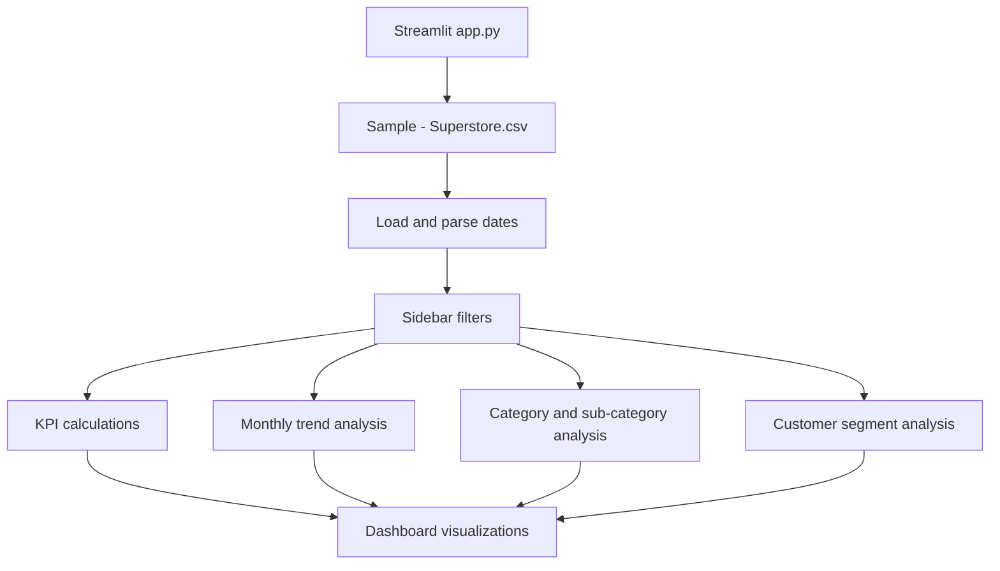

# E-Commerce Financial Performance
https://e-commerce-financial-performance-app.streamlit.app
Interactive Streamlit dashboard for exploring sales and profitability in the Sample Superstore dataset.

## Architecture



## Project Files

- `app.py`: Streamlit dashboard and data transformations
- `Sample - Superstore.csv`: Sales, order, customer, product, and profit data
- `e-commerce project.ipynb`: Original exploratory analysis notebook
- `requirements.txt`: Runtime dependencies
- `runtime.txt`: Python 3.11 deployment runtime

## Dashboard

The dashboard provides:

- Total sales, profit, profit margin, orders, and customers
- Year, category, and customer-segment filters
- Monthly sales and profit trends
- Sales share by category
- Profit by category
- Top sub-categories by sales
- Segment-level sales, profit, and margin metrics
- Downloadable filtered records

The CSV is loaded with `latin-1` encoding because the source data contains non-UTF-8 product-name characters. Dates are parsed into month, year, and weekday fields for the trend analysis.

## Run Locally

```powershell
py -3.11 -m venv .venv
.\.venv\Scripts\Activate.ps1
python -m pip install -r requirements.txt
python -m streamlit run app.py
```

Open `http://localhost:8501` after Streamlit starts.

## Scope

This is a descriptive financial analysis application. It does not include forecasting or machine-learning prediction logic.
